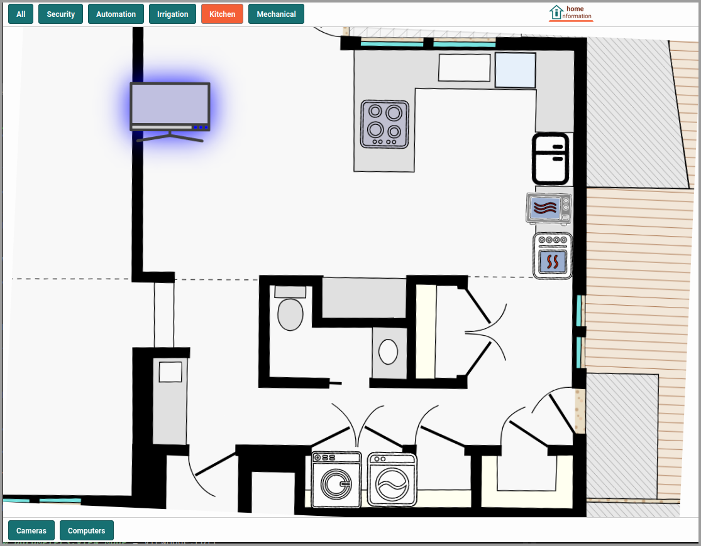
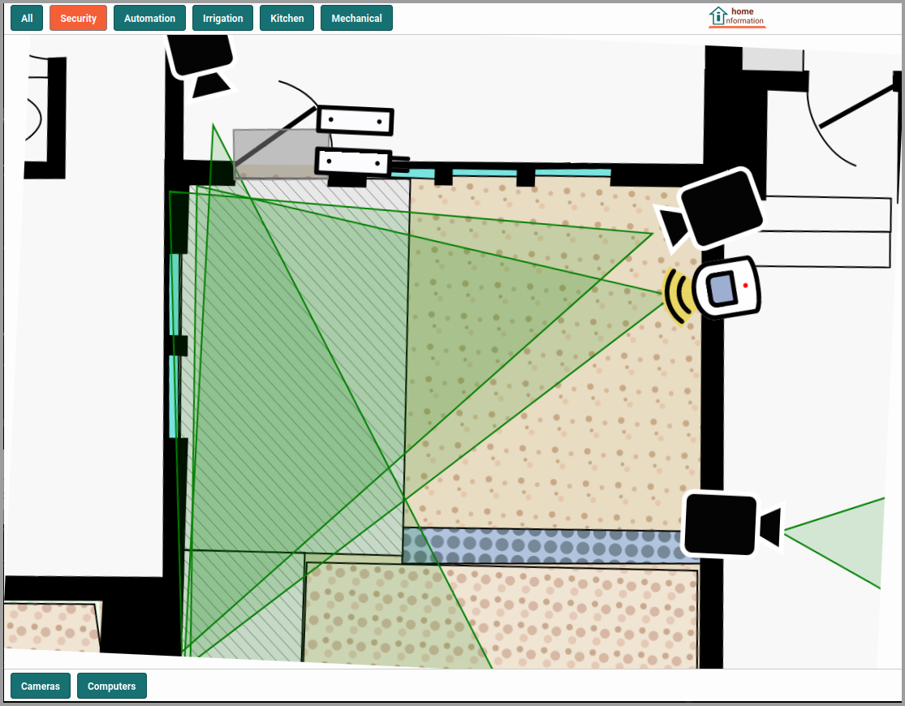
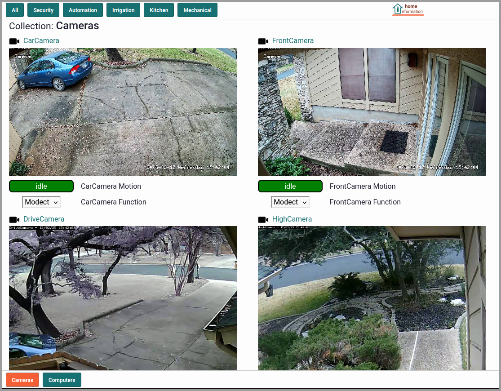

# Home Information

An application to visually organize data about your home and the things in it. Add and position items on the screen and then attach notes, manuals, links, maintenance and repair histories or any other information for easy reference. Optionally integrates with security and home automation systems for a single view of all your home-related information.

  

You can also see the [Getting Started Page](docs/GettingStarted.md) to get a feel for how it looks and works.

## Project Status

We are looking for early adopters and contributors. The software is functional, but early in its development with many additional features planned.

# Installation / Running

## Requirements

- Python 3 - installed
- Docker - installed and running

## Install and Run (Quick Start)

_For those that just want to run, use and/or explore the application._

Download the latest release from: https://github.com/cassandra/home-information/releases/latest and unzip or untar it.
``` shell
unzip ~/Downloads/home-information-*.zip 
cd home-information*
make env-build
make docker-build
make docker-run-fg
```
See the [Installation Page](docs/Installation.md) for more details and troubleshooting.

## Running

Run in the foreground with:
``` shell
make docker-run-fg
```
or in the background with:
``` shell
make docker-run
```

Then visit: [http://localhost:9411](http://localhost:9411) and the [Getting Started Page](docs/GettingStarted.md).

# Development

_For those that are interested in contributing or just peeking under the hood._

## Requirements

- Python 3.11 (or higher) - installed

## Tech Stack

- Django 4.2
- Javascript using jQuery 3.7
- Bootstrap 4 (CSS)
- SQLite (database)
- Redis (caching)

## Development Setup Overview

Setting up for local development, in brief, looks like this:
``` shell
# Fork the repo: https://github.com/cassandra/home-information

# Clone your fork
git clone https://github.com/${YOURUSERNAME}/home-information.git

# Initialize the environment and database
cd home-information
make env-build-dev
python3.11 -m venv venv
. ./init-env-dev.sh
pip install -r src/hi/requirements/development.txt
cd src
./manage.py check
./manage.py migrate
./manage.py hi_createsuperuser
./manage.py hi_creategroups
./manage.py runserver
```

See the [Contributing](CONTRIBUTING.md) and [Development](docs/Development.md) pages for more details.

---

# Resources

- [Installation](docs/Installation.md)
- [Getting Started](docs/GettingStarted.md)
- [Development](docs/Development.md)
- [Integrations](docs/Integrations.md)
- [Contributing](CONTRIBUTING.md)
- [Code of Conduct](CODE_OF_CONDUCT.md)
- [Security](SECURITY.md)
- [ChangeLog](CHANGELOG.md)
- [License](LICENSE.md)
