# Layout Editor

This page provides an overview of the editing mode features and basic operations. Editing mode is not the main mode used day-to-day. It is only used to initially setup you home and then occasionally to adjust the layout and add/remove items.

You enter edit mode with the "EDIT" button near the top right of the screen.

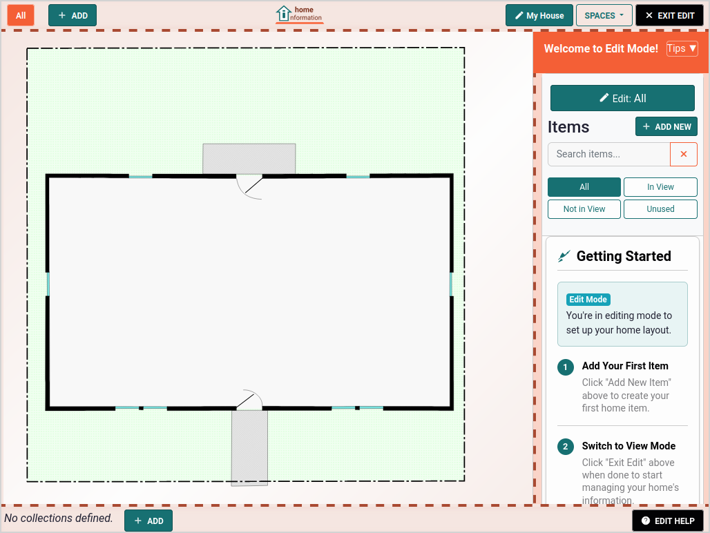

## Adding Items

As an example, we'll add a refrigerator by clicking the "ADD NEW ITEM" button, giving it a name and choosing the "type" of item it is:

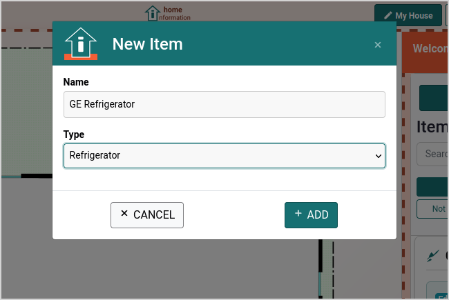 

After clicking the add button, you will see an icon for the refrigerator in the middle of the screen.  We can now use the mouse or touch screen to reposition it. Click the icon to highlight it, then drag it to the position you want. Use the `s` key (scale) and then the `+` and `-` keys to change its size.

   

When selecting an item, the right side of the screen changes to show the layout details of that item. Clicking the "X" in the upper right of that area returns the side view to allow adding more items.

There are many options for adjusting the layout of an item. See the "EDIT HELP" button on the bottom right of the screen for more information.

### Item Icons and Areas

The refrigerator type items will show with a refrigerator icon and most other item types have their own icons.  However, some types of items can represent larger areas or allow you to define them with a custom shape. For example, let's show adding an "area" to represent a pool.  This pool item will allow us to keep all the information we have about our pool.

First click "ADD NEW ITEM", give it the name "Pool", choose the "Area" type and click the "ADD" button. 

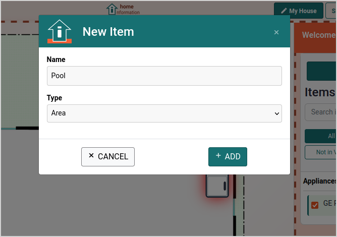 &nbsp; 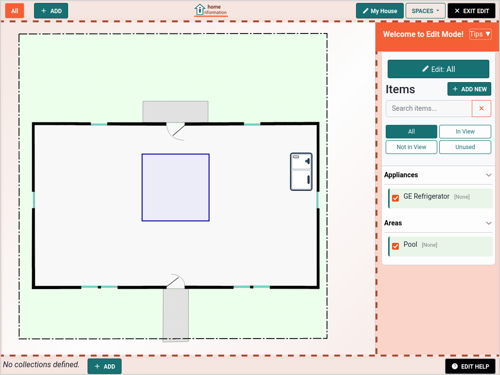

This will result in a square area that you can move and reshape. Click the square area to begin editing the shape. It will change color and show circles/dots where the lines meet. Click the dots to select then drag them to a new location until it has the shape you want.

 &nbsp; 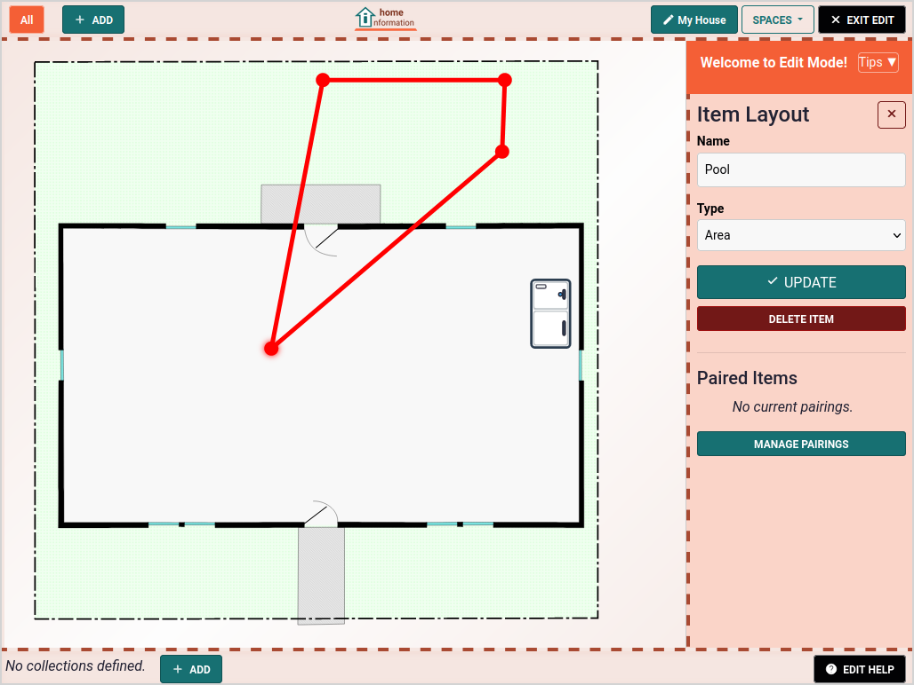

You are not limited to square shapes either. With a dot or line selected, press the `i` key to insert new points and move them where you want.  Press the `ESC` key when done editing.

 &nbsp; 

### Line Items

Another type of item is like an area, but for representing linear items. For example, suppose you have underground electric service and would like to show where the underground line runs. 

Click "ADD NEW ITEM", give it the name "Electric Service Line", choose the "Electric Wire Line" type and click the "ADD" button. 

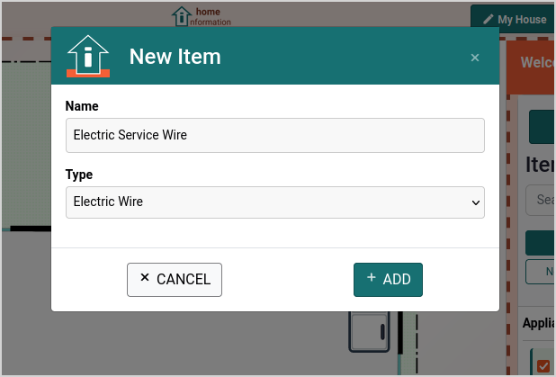 &nbsp; 

As with the area items, clicking it will give you the ability to edit by moving and/or adding points to it, pressing the `ESC` key when done.

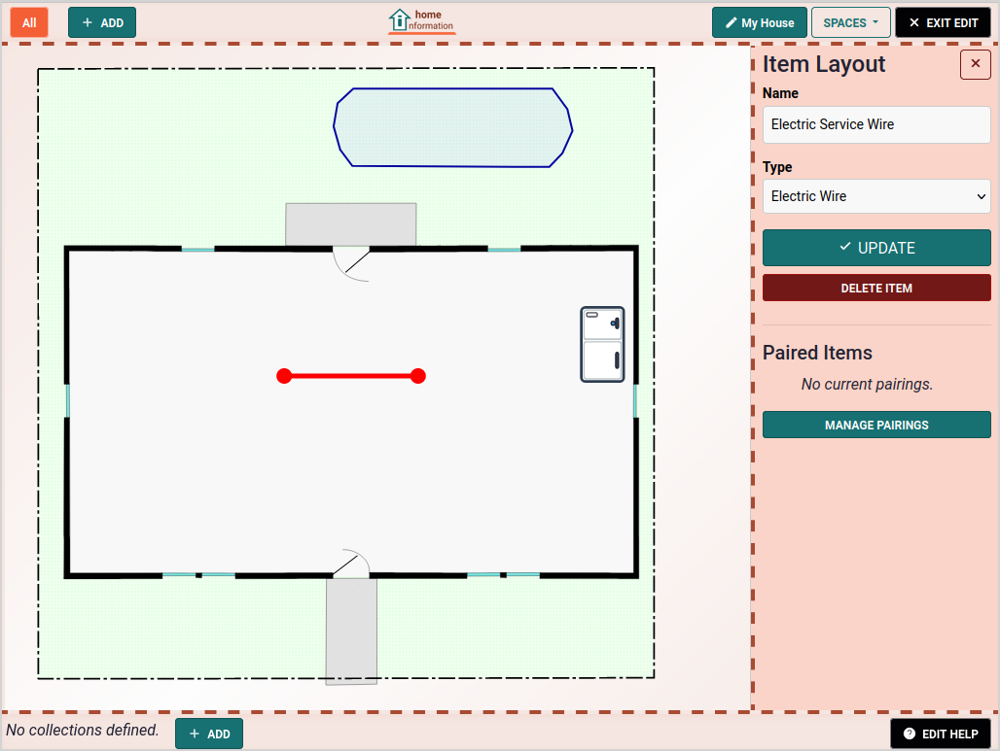 &nbsp;  &nbsp; 

### Collections

Not every item you may want to keep information about will make sense to have a specific location. For example, power tools and small appliances are items that you may have user manuals, replacement part info, etc.  Though you could add them as we have been doing, sometimes you just want to keep a list of these "movable" items.

A "collection" can be used to put items into meaningful groups, like "Small Appliances" or "Power Tools".  The bottom left of the screen will show all the defined collections, though we need to add some first by clicking the "ADD" button which brings up a dialog.

A few notes about this dialog:
- The "Display" can be a List or Grid view, depending on your preferences.
- The "Order Id" just defines the order they will appear at the bottom of the screen.
- You can optionally represent the entire collection as one item in the graphical view if you want.

After adding, you will now see a button for the new collection at the bottom left. Clicking the button will change the main center view from the graphical view to the collection view.  Here we could add existing items by clicking the checkboxes on the right panel.  Note that any items you add can appear in the graphical view, the collection or both and you can easily toggle them on and off with a click of those checkboxes on the right.

  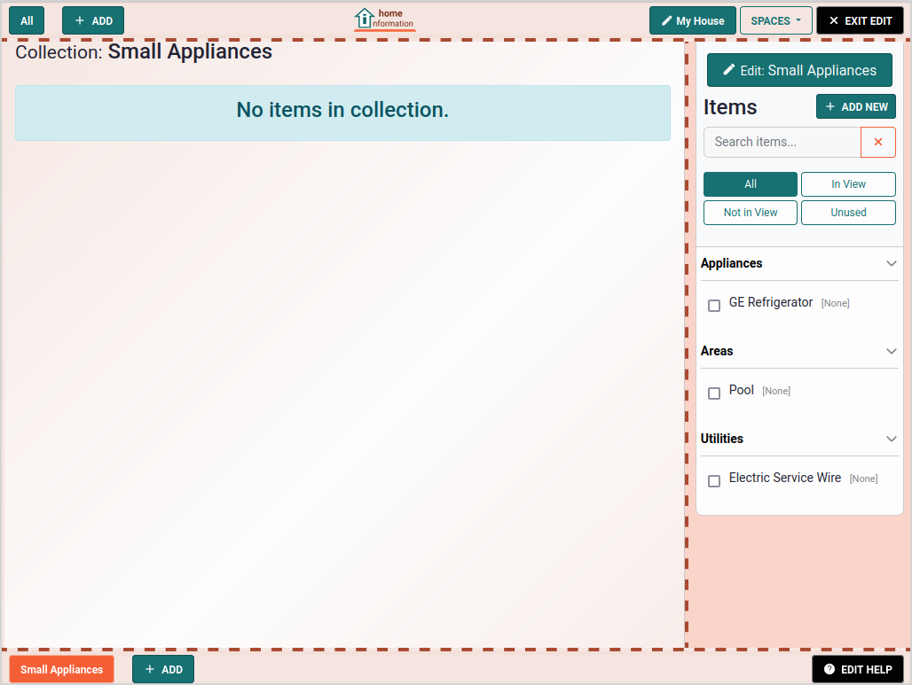 

However, since we have not added any small appliances yet, we can go and do this now by clicking the "ADD NEW ITEM" button.  When viewing a collection, that button adds a new item and will also add it to the collection.  When in the graphical view, it adds it to that view.  Here is what the collection view look like after adding a bunch of small appliances. It shows both the list view (left) and grid view (right).

  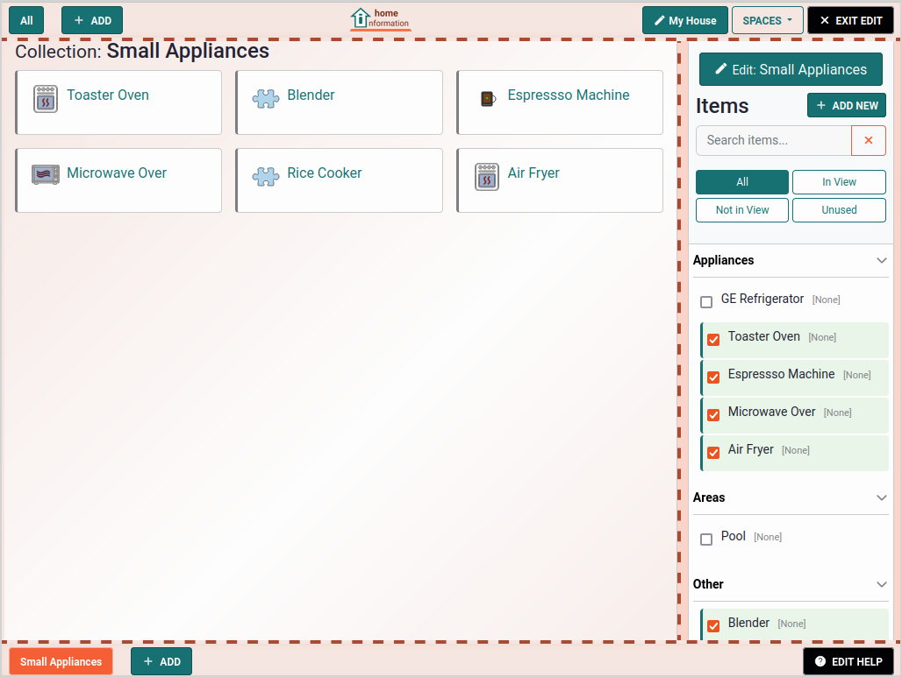 

### Multiple Views

So far, we have seen just the one "view".  As more and more items are added, a single screen can get cluttered, often with a mix of concerns that would be better separated.  We can add as many different views as we need to do this.  Each view can define which items do an do not appear in the view and you can switch between views with the top left buttons.  An item can appear in just one or multiple views and/or multiple collections.

By default, you will see there is just one view created called "All".  In editing mode you will also see the "ADD" button to create new views.  Let's suppose we want to have a view that just focuses on the items in the Kitchen area. Click the "ADD" button, given it a name in the dialog and then you will see a new button and a new, but empty view.

 &nbsp;  

We can add any existing kitchen items from the list at right, with the refrigerator being the only applicable one (unless you want to show all the small appliances too.)  Let's toggle the refrigerator and add a bunch of our other kitchen items: oven, cooktop, microwave, etc. We move and scale them as we did with the refrigerator to get something like this:

This is a good start, but we'd also like to zoom in to focus just on that kitchen area.  The view allows zooming in and moving it around by clicking the background then using the mouse wheel, two finger pinching and/or dragging.  By doing this, you can show only the kitchen area.

However, most of the time, zooming and moving the view is done on a temporary basis as you move around the view. For the Kitchen view, we want to have this change permanent, so we need to enter the view editing pane in order for changes to be saved.

Near the top right, there is the "View: Kitchen" label and a "EDIT" button to its right.  That is how to enter the editing mode for this view to make any zooming and moving permanent. 

After adjusting the view with the view editing area open, now when you click the "Kitchen" button on the top left, it will zoom in to that saved geometry.

### Multiple Spaces

The views we've seen so far are all defined with respect to a single "Space", which is the default space you gave a name to when your first started.  A single space only has one background image and the views are just different windows into that spaces's image.

However, if you have a two-story house, an attic or basement, you may want to define two or three spaces, so you can place items in a more logical place.  For example, if your Air Conditioner's Air Handler is in your attic and you want to keep information about it, it would make sense to define an "Attic" space and represent it there instead of placing it on the floor below.

When in editing mode, there is a space drop-down on the top right that allows you to add a new space.  This opens a dialog and you give it a name and an optional SVG background image and from then on can change to that space with the drop-down.

 &nbsp; 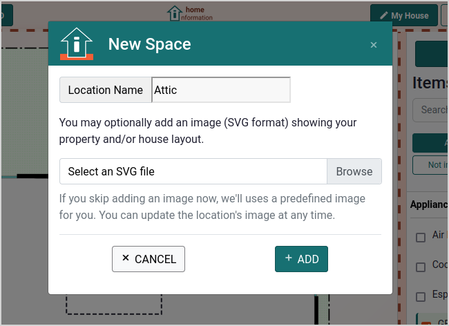 &nbsp; 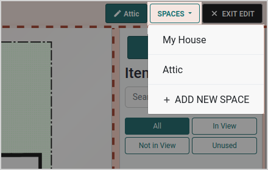

Below is the Attic space's view after using a custom SVG background and adding the A/C Air Handler, some control wire routes, exhaust fans and a skylight.

## Custom Background Images

When creating a new space, you get the option to add a custom background image. However, you can also change the background image at any time by choosing "EDIT" by the space name.

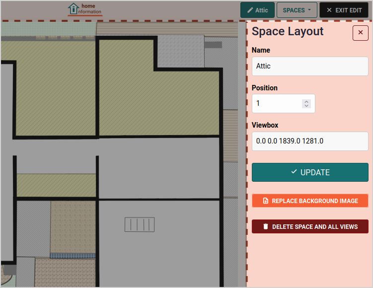

To create your own custom background image, see the [Custom Background Image Page](CustomBackgrounds.md).
