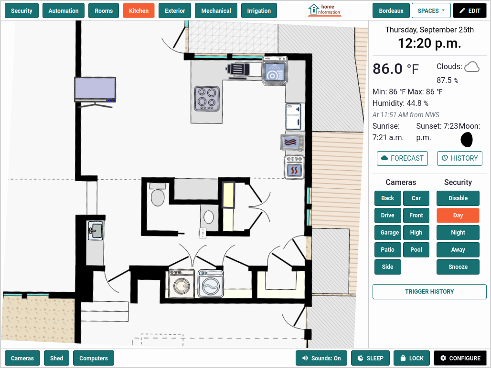
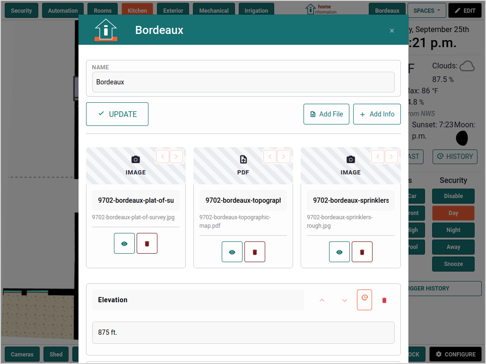

# Why Home Information?

 &nbsp; 

## The Home Information Problem

Modern homes are more complex than ever. Between smart devices, security systems, appliances, maintenance schedules, warranties, and documentation, homeowners are drowning in scattered information. Consider these common frustrations:

- **"Where did I put the HVAC manual?"** - Important documents get lost in email attachments, filing cabinets, or forgotten cloud folders
- **"When was the water heater last serviced?"** - Maintenance histories live in different apps, notebooks, or not at all
- **"Which security camera covers the back door?"** - Device-centric interfaces don't match how we think about our homes
- **"What's the model number of that outlet in the guest room?"** - Product information scattered across purchase receipts, photos, and memory

## Why Existing Solutions Fall Short

**Device-Centric Thinking:** Most home automation platforms organize by device type or manufacturer. You have a "lights" section, a "cameras" section, a "sensors" section. But when you're standing in your kitchen wondering about the refrigerator's warranty, you don't want to navigate through a generic "appliances" category.

**Information Silos:** Your security system knows about cameras. Your home automation knows about switches. Your phone has photos of model numbers. Your computer has PDF manuals. Your notebook has maintenance records. Nothing connects.

**Complexity Over Simplicity:** Many systems add complexity rather than reducing it. You end up managing the management system instead of just managing your home.

## The Home Information Approach

**Spatial Organization:** We organize information the way you think about your home - by location and context. Click on your kitchen, see everything kitchen-related. Click on your HVAC unit, see its manual, service history, and current status all in one place.

**Information-First Design:** Instead of starting with devices and adding information as an afterthought, we start with information and integrate device control where it makes sense.

**Single Pane of Glass:** One interface that brings together documents, maintenance records, device controls, security monitoring, and any other home-related information you need to track.

## Real-World Use Cases

### The Organized Homeowner
*Sarah wants to maintain her home proactively but struggles with scattered information.*

**Before:** Maintenance schedules in a phone app, manuals in a filing cabinet, warranty info in email, service company contacts in an address book, and no systematic way to track what's been done when.

**After:** Click on the HVAC unit in her Home Information view to see the manual, service history, warranty expiration, scheduled maintenance reminders, and the HVAC company's contact info. Everything needed to maintain that system in one logical place.

### The Tech-Savvy Family
*The Johnsons have invested in home automation and security but find managing it overwhelming.*

**Before:** Home Assistant app for device control, ZoneMinder for cameras, separate apps for different smart devices, paperwork scattered everywhere, and no unified view of what's happening in their home.

**After:** Their Home Information interface shows their home layout with all devices positioned where they actually are. Click on any room to see device status, control options, and relevant documentation. Security events and camera feeds integrate naturally with the spatial layout.

### The New Homeowner
*Mike just bought his first house and feels overwhelmed by everything he needs to track.*

**Before:** A box of random paperwork from the previous owner, phone photos of model numbers, scattered bookmarks for online manuals, and no systematic way to understand what he actually owns.

**After:** Systematically builds his Home Information database by adding items room by room, uploading manuals and warranty info as he discovers it, and creating a comprehensive record he can reference and build upon.

### The Vacation Home Owner
*Lisa owns a mountain cabin she visits monthly and needs to monitor remotely.*

**Before:** Worrying about what might go wrong while away, difficult to check on systems remotely, and complicated handoff of information to caretakers or repair services.

**After:** Integrated monitoring through security cameras and home automation, with all system information and service contacts readily available. Can quickly check status, review historical data, and provide comprehensive information to service providers when needed.

## Key Differentiators

### vs. Traditional Home Automation Platforms
- **Location-centric vs. device-centric organization**
- **Information management as core feature, not afterthought**
- **Integrates existing systems rather than replacing them**

### vs. Generic Information Management Tools
- **Spatial organization matches how you think about your home**
- **Purpose-built for home management use cases**
- **Integrates monitoring and control capabilities**

### vs. Maintenance Tracking Apps
- **Visual, contextual interface rather than lists and forms**
- **Integrates device status and control**
- **Supports all types of home information, not just maintenance**

## Philosophy: People-Centered Home Technology

We believe home technology should make life simpler, not more complex. That means:

**Starting with your mental model** - How do you think about your home? By rooms, by systems, by priorities. Not by manufacturers or device categories.

**Progressive enhancement** - Start simple with just information management. Add integration and automation as it provides value, not because the technology exists.

**Ownership and control** - Your home information stays in your home, under your control. No cloud dependencies for core functionality.

**Integration, not replacement** - Work with your existing investments in security systems, home automation, and smart devices rather than forcing you to start over.

The goal isn't to build another home automation platform. It's to create the missing piece that makes all your home technology actually useful for managing your life.
