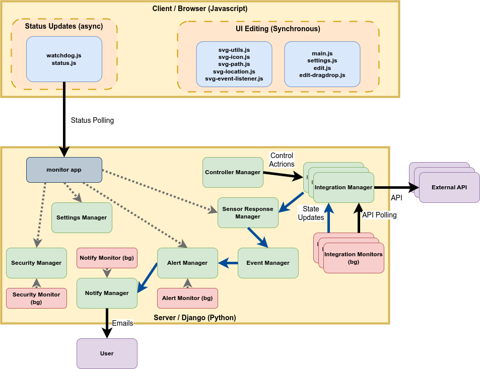

# Architecture

## Core Django Applications

**Entity App**: Central model for all physical/logical objects (devices, features, software). Uses integration keys for external system connectivity and supports SVG-based positioning.

**Location App**: Physical space management with SVG-based floor plans. Manages hierarchical locations and spatial positioning of entities and collections.

**Sense App**: Sensor data collection and monitoring. Links to EntityState with history persistence for various sensor types.

**Control App**: Device control and automation. Manages controllable devices with action history tracking.

**Event App**: Event-driven automation system with multi-clause triggers, time windows, and automated responses.

**Alert App**: Alert and alarm management using singleton pattern with queue-based processing.

**Collection App**: Logical grouping and organization of entities for management and display.

**Weather App**: Weather data integration with pluggable sources (NWS) and data aggregation.

## Integration Layer

**Home Assistant Integration** (`src/hi/services/hass/`): Full two-way sync with Home Assistant including entity mapping, state synchronization, and controller integration.

**ZoneMinder Integration** (`src/hi/services/zoneminder/`): Camera and video surveillance system integration for security monitoring.

**Integration Pattern**: All external systems use integration keys for mapping entities between systems.

## Key Architectural Patterns

- **Entity-Centric Design**: All controllable/observable items modeled as entities with states
- **Singleton Managers**: Core functionality uses singleton pattern (AlertManager, WeatherManager)
- **SVG-Based Visualization**: Locations and entities support SVG graphics for spatial representation
- **Mixin Pattern**: Common functionality shared through mixins (SecurityMixins, NotifyMixins)
- **Event-Driven Architecture**: Automated responses based on state changes and sensor readings

## File Structure Conventions

- `apps/*/models.py`: Django models for each application
- `apps/*/managers.py`: Business logic managers (often singletons)
- `apps/*/transient_models.py`: Non-database models for data transfer
- `apps/*/templates/*/panes/`: UI component templates
- `apps/*/templates/*/modals/`: Modal dialog templates
- `apps/*/tests/`: Unit tests and test data
- `integrations/`: Cross-system integration framework
- `services/*/`: External service integrations (HASS, ZoneMinder)

## Database and Dependencies

- **Database**: SQLite for development, supports PostgreSQL for production
- **Cache**: Redis required for development and production
- **Frontend**: jQuery 3.7, Bootstrap 4, custom SVG manipulation
- **Python**: 3.11+, Django 4.2

## System Architecture Patterns

### Module Dependency Hierarchy
- **Entity/EntityState**: Central hub used by control, event, sense, collection modules
- **Location/LocationView**: Complex SVG positioning system used by entity, collection
- **Integration Key Pattern**: Shared across control, event, sense for external system integration
- **Cascade Deletion Chains**: Critical data integrity enforcement across related models

### Auto-Discovery and Django Integration
- **Settings Manager**: Tightly integrated with Django initialization, requires special handling in tests
- **Module Loading**: Some managers use Django apps registry for auto-discovery of monitors/handlers
- **Startup Dependencies**: Initialization order matters for singleton managers
- **Cache Integration**: Some managers integrate with Redis/cache systems requiring mocking in tests
- **Background Process Integration**: Manager classes designed for both Django web context and background processes
- **Thread Management**: Some managers spawn background threads that must coordinate with Django lifecycle
- **Async/Sync Dual Access**: Manager classes provide both synchronous and asynchronous interfaces for different contexts

### Background Process and Threading Patterns
- **AppMonitorManager**: Manages async event loops and background monitoring threads
- **Dual Interface Pattern**: Manager classes expose both sync and async methods (e.g., `do_control()` and `do_control_async()`)
- **Django + AsyncIO Integration**: Background processes must coordinate Django ORM with asyncio event loops
- **Startup Coordination**: Background threads initialized during Django startup sequence
- **Graceful Shutdown**: Background processes must handle Django shutdown signals properly
- **Thread Safety**: Manager singletons use threading.Lock() for safe access from multiple threads
- **Event Loop Management**: Some managers maintain their own asyncio event loops separate from Django
- **Process Separation**: Some functionality runs in separate processes from Django web server
- **Shared State Management**: Managers handle state synchronization between web and background processes
- **Database Connection Handling**: Background processes manage their own DB connections separate from request cycle

### Performance and Concurrency Patterns
- **TTL Caching**: StatusDisplayManager uses cachetools for performance optimization
- **Thread Safety**: Manager classes use threading.Lock() for concurrent access
- **Deque-based Aggregation**: Alert system uses collections.deque with maxlen for memory efficiency
- **Database Indexing**: Strategic use of db_index=True for query performance

### Complex Business Logic Patterns
- **SVG Geometric Calculations**: Location positioning, viewbox conversions, bounds calculation
- **Enum Business Rules**: Security states with auto_change_allowed and notification logic
- **File Lifecycle Management**: Automatic cleanup on deletion, unique filename generation
- **Event Window Logic**: Time-based event aggregation with deduplication windows

## Security and Configuration

- Environment variables managed via `.private/env/` (not committed)
- Settings split by environment: `development.py`, `production.py`, `staging.py`
- Config app provides centralized system configuration storage 
