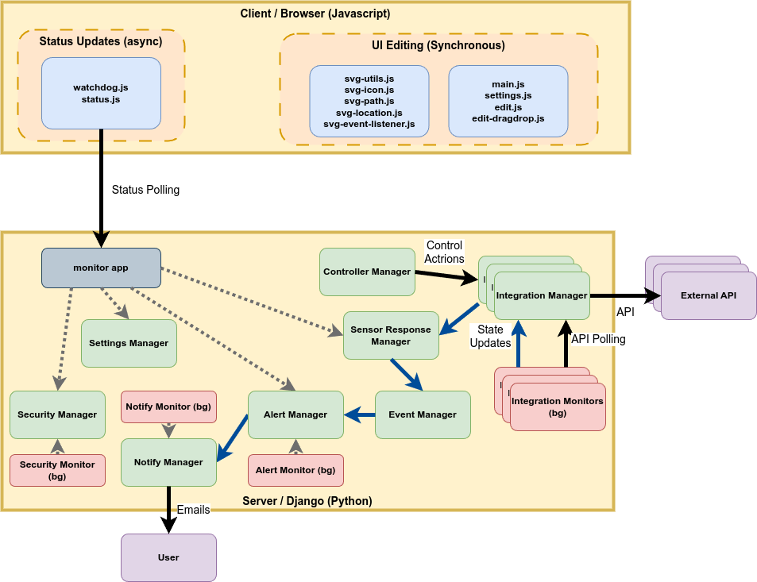

# Architecture Overview

## High-level Principles

**Local First**: The design philosphy adheres to the "Local First" principle.  The entire application should be able to run locally with no external dependencies and no Internet connection.  It should alllow API integrations if they are run locally and it should gracefully degrade for any external APIs that are used.

**Limited Responsiveness**: The predominant use of this app is in a tablet in landscape mode with a touch screen. There secondary usage would be a laptop or desktop. For mobile (phone) devices, we only need for it to render well enough to be usable in the phone's landscape mode. We can assume that we do not have to support very narrow widths of a phone in portrait mode.

**Modal Operation**: The application is modal having an edit mode, and a number of different viewing modes. The editing mode of the application has the semantic purpose of adjusting the visual layout of the screen. This is only the predominant view when the user is first setting up and configuring the app for their home. Once set up, normal use is in the viewing modes with occasional tweaks/edit to the visual layout.

## Core Django Applications

**Entity App**: Central model for all physical/logical objects (devices, features, software). Uses integration keys for external system connectivity and supports SVG-based positioning.

**Location App**: Physical space management with SVG-based floor plans. Manages hierarchical locations and spatial positioning of entities and collections.

**Sense App**: Sensor data collection and monitoring. Links to EntityState with history persistence for various sensor types.

**Control App**: Device control and automation. Manages controllable devices with action history tracking.

**Event App**: Event-driven automation system with multi-clause triggers, time windows, and automated responses.

**Alert App**: Alert and alarm management using singleton pattern with queue-based processing.

**Collection App**: Logical grouping and organization of entities for management and display.

**Weather App**: Weather data integration with pluggable sources (NWS) and data aggregation.

## Integration Layer

**Home Assistant Integration** (`src/hi/services/hass/`): Full two-way sync with Home Assistant including entity mapping, state synchronization, and controller integration.

**ZoneMinder Integration** (`src/hi/services/zoneminder/`): Camera and video surveillance system integration for security monitoring.

**Integration Pattern**: All external systems use integration keys for mapping entities between systems.

## Key Architectural Patterns

- **Entity-Centric Design**: All controllable/observable items modeled as entities with states
- **Singleton Managers**: Core functionality uses singleton pattern (AlertManager, WeatherManager)
- **SVG-Based Visualization**: Locations and entities support SVG graphics for spatial representation
- **Mixin Pattern**: Common functionality shared through mixins (SecurityMixins, NotifyMixins)
- **Event-Driven Architecture**: Automated responses based on state changes and sensor readings

## System Architecture Patterns

### Module Dependency Hierarchy
- **Entity/EntityState**: Central hub used by control, event, sense, collection modules
- **Location/LocationView**: Complex SVG positioning system used by entity, collection
- **Integration Key Pattern**: Shared across control, event, sense for external system integration
- **Cascade Deletion Chains**: Critical data integrity enforcement across related models

### Auto-Discovery and Django Integration
- **Settings Manager**: Tightly integrated with Django initialization
- **Module Loading**: Some managers use Django apps registry for auto-discovery
- **Startup Dependencies**: Initialization order matters for singleton managers
- **Cache Integration**: Managers integrate with Redis/cache systems
- **Background Process Integration**: Manager classes for both Django web and background contexts

### Background Process and Threading Patterns
- **AppMonitorManager**: Manages async event loops and background monitoring threads
- **Dual Interface Pattern**: Manager classes expose both sync and async methods
- **Django + AsyncIO Integration**: Background processes coordinate Django ORM with asyncio
- **Thread Safety**: Manager singletons use threading.Lock() for safe concurrent access
- **Event Loop Management**: Some managers maintain separate asyncio event loops
- **Shared State Management**: Managers handle state sync between web and background processes

### Performance and Concurrency Patterns
- **TTL Caching**: StatusDisplayManager uses cachetools for performance optimization
- **Deque-based Aggregation**: Alert system uses collections.deque with maxlen
- **Database Indexing**: Strategic use of db_index=True for query performance

## Database and Dependencies

- **Database**: SQLite for development, supports PostgreSQL for production
- **Cache**: Redis required for development and production
- **Frontend**: jQuery 3.7, Bootstrap 4, custom SVG manipulation
- **Python**: 3.11+, Django 4.2

## Security and Configuration

- Environment variables managed via `.private/env/` (not committed)
- Settings split by environment: `development.py`, `production.py`, `staging.py`
- Config app provides centralized system configuration storage

## Related Documentation

- Data Model and Concepts [Data Model](./data-model.md)
- Detailed backend patterns: [Backend Guidelines](../backend/backend-guidelines.md)
- Integration specifics: [Integration Guidelines](../integrations/integration-guidelines.md)
- Domain models: [Domain Guidelines](../domain/domain-guidelines.md)
- Frontend architecture: [Frontend Guidelines](../frontend/frontend-guidelines.md)
