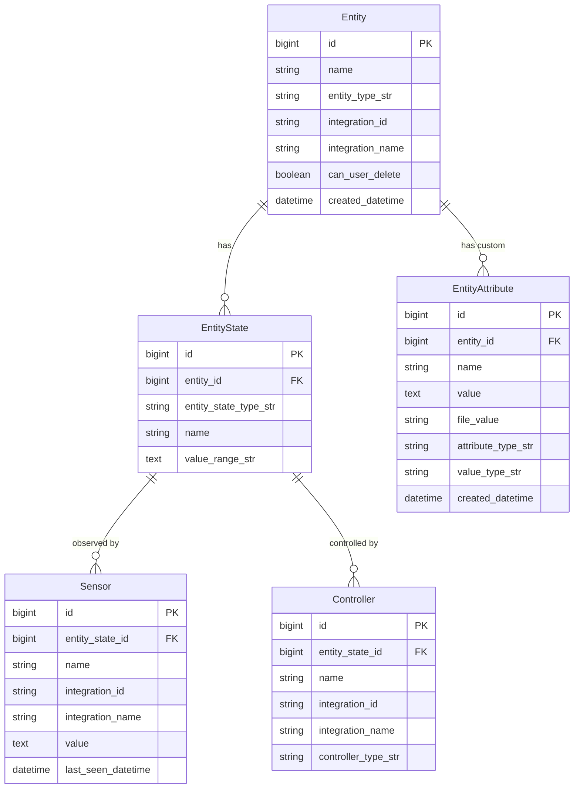

# Core Model Relationships Diagram

This diagram shows how the system models physical devices, their states, and the sensors/controllers that interact with those states.

## Key Relationships

- **Entity → EntityState**: One-to-many. An entity can have multiple internal states (temperature, on/off, etc.)
- **EntityState → Sensor**: One-to-many. Multiple sensors can observe the same state
- **EntityState → Controller**: One-to-many. Multiple controllers can affect the same state
- **Entity → EntityAttribute**: One-to-many. Users can add unlimited custom attributes

## Alternative Formats

- [PlantUML Version](core-model.plantuml) - For use with PlantUML renderers
- [Back to Data Model Overview](../data-model.md)