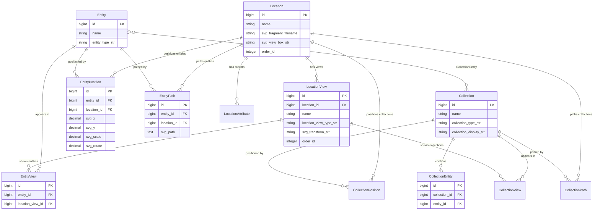

# Display Model Relationships Diagram

This diagram shows how items are positioned and displayed in the visual interface.

## Key Relationships

- **Location → LocationView**: One-to-many. Multiple views/perspectives of the same space
- **Location → Position/Path**: One-to-many. Items positioned within the location
- **Entity → Position/Path**: One-to-many. Same item can appear in multiple locations
- **Entity ↔ Collection**: Many-to-many through CollectionEntity join table
- **LocationView → EntityView/CollectionView**: Controls what appears in each view

## Visual Organization Concepts

This model enables:
- Same entity appearing in multiple locations or views
- Different visual representations (icon vs. path)
- Collections independent of physical positioning
- View-specific filtering and organization

## Alternative Formats

- [PlantUML Version](display-model.plantuml) - For use with PlantUML renderers
- [Back to Data Model Overview](../data-model.md)