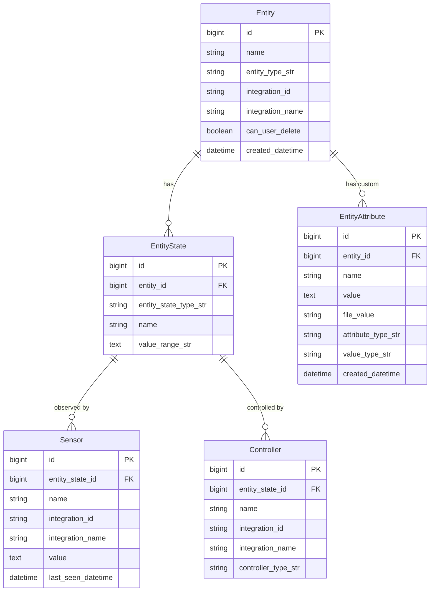
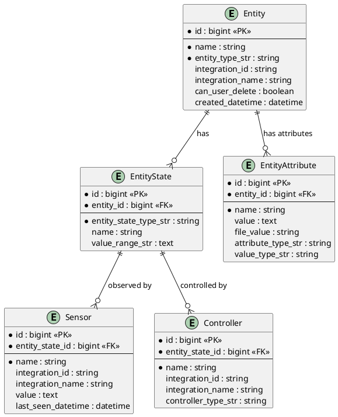
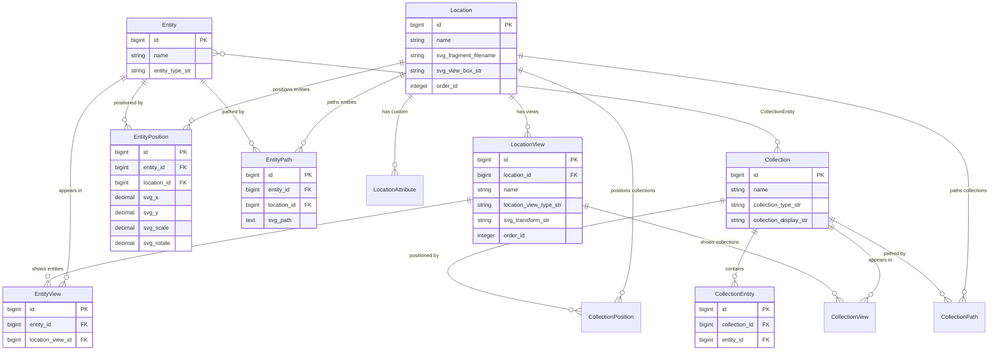
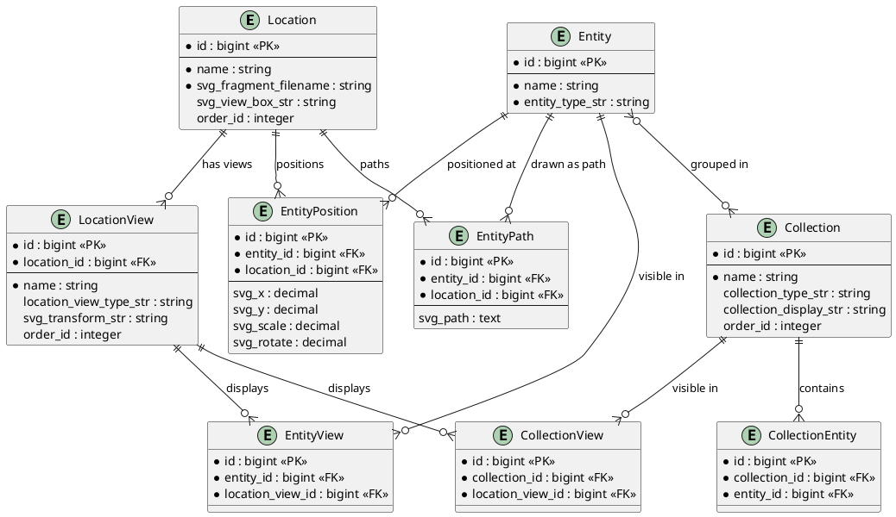

# Home Information Model Relationships

This document provides visual diagrams of the core data model relationships in Home Information.

## 1. Core Model Relationships (Device & State Architecture)

This diagram shows how the system models physical devices, their states, and the sensors/controllers that interact with those states.

### Mermaid Diagram

### PlantUML Alternative

### Key Concepts

- **Entity**: Represents physical items in your home (refrigerator, light switch, thermostat, etc.)
- **EntityState**: The hidden internal state of an entity that can be sensed or controlled (e.g., on/off, temperature, open/closed)
- **Sensor**: Observes and reports the value of an EntityState (e.g., motion sensor, temperature sensor)
- **Controller**: Can change the value of an EntityState (e.g., switch controller, thermostat controller)
- **EntityAttribute**: User-defined custom information about an entity (manuals, notes, warranties, etc.)

## 2. Display Model Relationships (Visual Organization)

This diagram shows how items are positioned and displayed in the visual interface.

### Mermaid Diagram

### PlantUML Alternative

### Key Concepts

- **Location**: A physical space (house, floor, property) with an SVG background
- **LocationView**: A specific view/zoom into a Location (e.g., "Kitchen View", "Security View")
- **Entity**: Items that can be displayed (same as in Core Model)
- **Collection**: Named groups of entities (e.g., "Power Tools", "Small Appliances")
- **EntityPosition**: Defines where an entity appears as an icon (x, y, scale, rotation)
- **EntityPath**: Defines an entity as an SVG path (for linear items like pipes, wires)
- **EntityView**: Links an entity to specific LocationViews where it should appear
- **CollectionEntity**: Many-to-many relationship between Collections and Entities
- **CollectionView**: Links a collection to specific LocationViews where it should appear

## Understanding the Architecture

### Separation of Concerns

The architecture clearly separates:
1. **Physical/Logical Model** (Core): What things are and how they behave
2. **Visual/Display Model**: Where and how things appear visually

This separation allows:
- The same entity to appear in multiple views
- Different visual representations (icon vs. path) for the same entity
- Collections to organize entities independently of their physical location
- Views to show subsets of items relevant to specific concerns (security, HVAC, etc.)

### Data Portability

All relationships are stored in standard SQLite foreign key relationships, making the data:
- Queryable with standard SQL
- Exportable to other formats
- Understandable without the application
- Migratable to other systems if needed